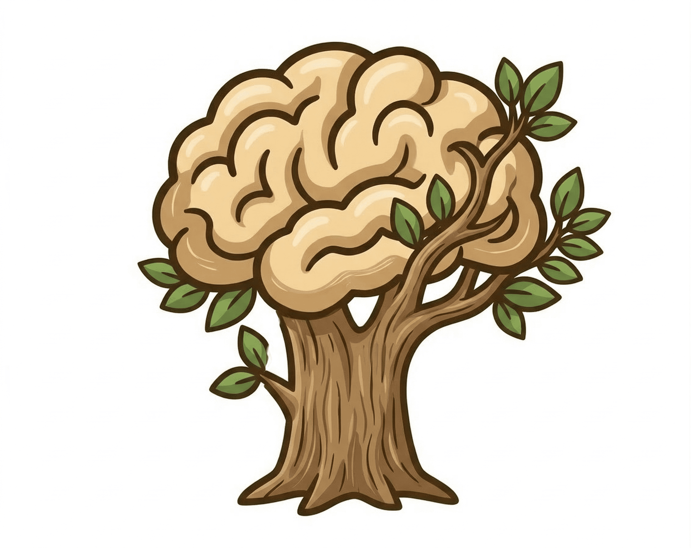
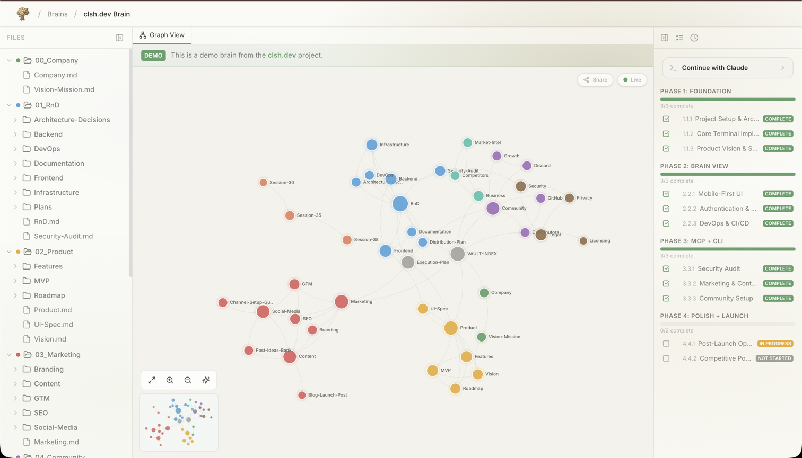
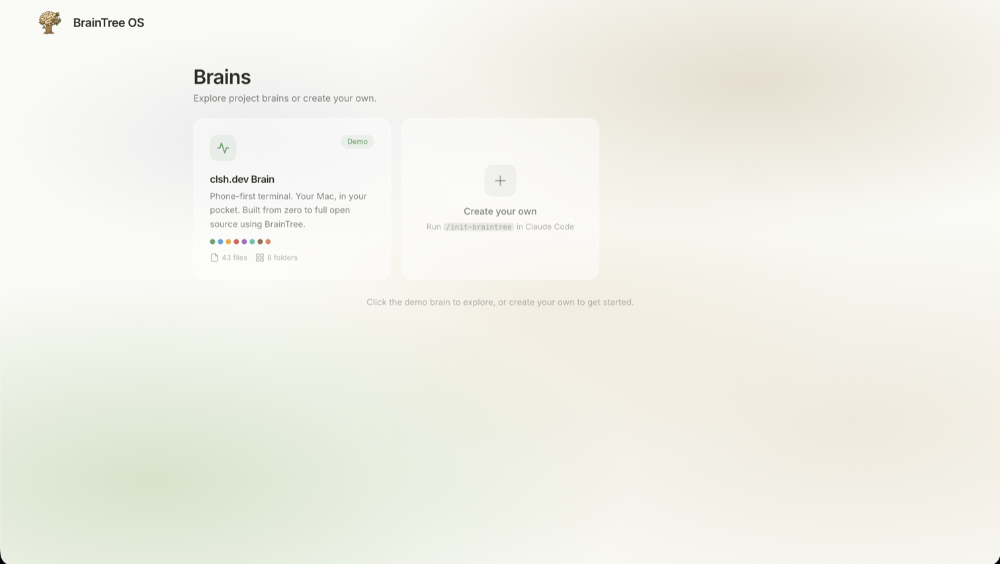

<div align="center">



# BrainTree OS

**Give your AI agent a brain.**

A local-first project management system designed for AI agents. One command starts a structured knowledge base with departments, execution plans, agent personas, and a live viewer. Your AI stops guessing and starts executing.

[](https://www.npmjs.com/package/brain-tree-os)
[](https://typescriptlang.org)
[](LICENSE)
[](CONTRIBUTING.md)
[](https://nodejs.org)

[Quick Start](#-quick-start) · [The Problem](#-the-problem) · [How It Works](#-how-it-works) · [Claude Commands](#-claude-commands) · [Codex Workflow](#-codex-workflow) · [Contributing](CONTRIBUTING.md)



</div>

---

## The Problem

AI coding assistants are powerful, but they have no memory between sessions. Every time you start a new conversation, you lose context. Your AI doesn't know what was built yesterday, what's blocked, or what to work on next.

**BrainTree OS solves this.** It gives your AI agent an organizational structure (a "brain") that persists across sessions. The brain contains everything: project vision, technical architecture, marketing strategy, execution plan, session handoffs, and agent personas. Your AI reads this brain at the start of every session and knows exactly where things stand.

**The result:** Instead of "what should I work on?", your AI says "Last session you completed the auth system. The API layer is now unblocked. Here are your top 3 priorities."

### What makes it different

- **Not a template generator.** BrainTree creates 25-40 files of real, actionable content tailored to YOUR project.
- **Not a task tracker.** It's a full organizational brain with departments, execution plans, and cross-linked knowledge.
- **Not cloud-dependent.** Everything runs locally. No accounts, no API keys, no data leaving your machine.
- **Not just for code.** Marketing, product strategy, business development, and operations are first-class citizens.

---

## Quick Start

> **Requires [Node.js 20+](https://nodejs.org) and either Claude Code or Codex**

### 1. Start the brain viewer

For Claude Code:

```bash
npx brain-tree-os
```

For Codex:

```bash
npx brain-tree-os --agent codex
```

This starts a local web server and opens a brain viewer in your browser. A demo brain is included so you can explore immediately.



### 2. Create your brain

**Claude Code workflow**

Open Claude Code in any project directory and run:

```text
/init-braintree
```

An interactive wizard asks about your project and generates a complete brain structure: departments, execution plan, agent personas, templates, and more.


**Codex workflow**

Open Codex in any project directory and ask it to scaffold a BrainTree brain. The key files are:

- `.braintree/brain.json`
- `BRAIN-INDEX.md`
- `AGENTS.md`
- `CLAUDE.md`
- `Execution-Plan.md`
- `Handoffs/`, `Templates/`, `Assets/`, and your department folders

A good starter prompt is:

```text
Initialize a BrainTree OS brain for this project. Create .braintree/brain.json, BRAIN-INDEX.md, AGENTS.md, CLAUDE.md, Execution-Plan.md, Handoffs/, Templates/, Assets/, and tailored department notes. Link every note with wikilinks and finish with an initial handoff.
```

See [docs/codex.md](docs/codex.md) for the full Codex workflow.

### 3. Start working

**Claude Code**

```text
/resume-braintree
```

Claude reads your brain, shows what was done last session, what is in progress, and what to tackle next. When you are done:

```text
/wrap-up-braintree
```

**Codex**

Start each session by reading `BRAIN-INDEX.md`, `AGENTS.md`, and the latest handoff. End each session by updating the handoff folder and execution plan.

---

## How It Works

```text
  You run: npx brain-tree-os
              |
              v
  +--------------------------------------+
  |  CLI                                 |
  |  1. Installs Claude commands         |
  |     OR runs in Codex mode            |
  |  2. Starts Next.js server            |
  |  3. Opens browser                    |
  +--------------------------------------+
              |
              v
  +----------------------------+     +--------------------+
  |  Brain Viewer (localhost)  |<--->|  Your Project      |
  |   - Graph visualization    |     |    .braintree/     |
  |   - File tree browser      |     |    BRAIN-INDEX.md  |
  |   - Markdown viewer        |     |    CLAUDE.md       |
  |   - Execution plan pane    |     |    AGENTS.md       |
  |   - Session timeline       |     |    Execution-Plan/ |
  +----------------------------+     |    Handoffs/       |
              |                      +--------------------+
         WebSocket
              |
              +--- live updates via chokidar ---+
```

When you create or edit files through Claude Code, Codex, or any other file-writing agent, they appear in the browser instantly. The viewer watches your filesystem and updates the graph, file tree, and content in real time.

---

## What's Inside a Brain

Every brain is a directory on your filesystem with this structure:

```text
my-project/
├── .braintree/
│   └── brain.json              # Brain metadata (id, name, description)
├── BRAIN-INDEX.md              # Central hub linking to everything
├── AGENTS.md                   # Codex/repo-specific instructions
├── CLAUDE.md                   # AI agent instructions (brain DNA)
├── Execution-Plan.md           # Build roadmap with phases and steps
│
├── 00_Company/                 # Identity, vision, mission, values
│   ├── Company.md              # Folder index
│   ├── Mission.md
│   └── Values.md
├── 01_RnD/                     # Engineering, architecture, tech stack
│   ├── RnD.md
│   ├── Architecture.md
│   └── Tech-Stack.md
├── 02_Product/                 # MVP scope, roadmap, features
│   ├── Product.md
│   ├── MVP-Scope.md
│   └── Feature-Priorities.md
├── 03_Marketing/               # Go-to-market, content, SEO
│   └── ...
│
├── Handoffs/                   # Session continuity documents
│   ├── Handoffs.md
│   ├── handoff-001.md
│   └── handoff-002.md
├── Templates/                  # Reusable note templates
├── Assets/                     # Images, PDFs, reference files
└── .claude/agents/             # Optional Claude agent persona files
    ├── builder.md
    ├── strategist.md
    └── researcher.md
```

### Key concepts

**BRAIN-INDEX.md** is the central hub. It links to every top-level folder and file. When your AI agent reads this first, it instantly understands the full project structure.

**AGENTS.md** is where Codex or repo-local rules live. It is the right place for repository-specific working instructions when your agent is not using Claude slash commands.

**CLAUDE.md** contains the brain's general "DNA": conventions, rules, and instructions that every AI agent follows. Think of it as the team handbook.

**Wikilinks** (`[[like this]]`) connect files into a knowledge graph. The viewer renders these as interactive nodes and edges. Every file links back to its parent via `> Part of [[ParentIndex]]`, creating a clean hierarchy with no orphan nodes.

**Execution Plan** is a structured build roadmap with phases, steps, and task checklists. Each step has a status (`not_started`, `in_progress`, `completed`, `blocked`) and dependencies on other steps.

**Handoffs** are session continuity documents. Each one captures what was done, decisions made, blockers found, and what to do next.

---

## Claude Commands

When you run BrainTree in Claude mode, it installs 8 slash commands into Claude Code. These remain the core of the Claude-native workflow.

### `/init-braintree`

**Create a new brain from scratch.**

A multi-phase interactive wizard that:
1. Asks about your project (what you're building, who it's for, what you have so far)
2. Generates a custom brain structure tailored to your specific goals
3. Creates 25-40+ files with real, actionable content (not empty templates)
4. Sets up agent personas matched to your needs
5. Builds an execution plan with phases and dependencies

The brain appears in the viewer in real time as files are created.

### `/resume-braintree`

**Resume work from where you left off.**

The most important Claude command. Every session starts here. It:
1. Reads your full brain context (BRAIN-INDEX, CLAUDE.md, latest handoff, execution plan)
2. Shows what was accomplished last session
3. Displays progress bars for each phase
4. Lists the top unblocked steps ranked by priority
5. Identifies parallel execution opportunities
6. Asks what you want to work on

### `/wrap-up-braintree`

**End your session with full continuity.**

Creates a bridge to your next session by:
1. Auditing everything done in the current session
2. Updating all affected brain files (departments, indexes, execution plan)
3. Marking execution plan steps as completed, in progress, or blocked
4. Creating a detailed handoff document with session summary, decisions, blockers, and next steps
5. Updating brain indexes to prevent orphan nodes

### Other Claude commands

- `/status-braintree` - project health dashboard
- `/plan-braintree [step]` - break a step into concrete tasks
- `/sprint-braintree` - plan a week of work
- `/sync-braintree` - audit and repair brain health
- `/feature-braintree [name]` - plan and implement a new feature

---

## Codex Workflow

Codex uses the same brain format but works from repository files rather than Claude slash commands.

### Session 0: Create your brain

```text
$ npx brain-tree-os --agent codex
$ codex
> Initialize a BrainTree OS brain for this project...
```

### Session 1+: The daily loop

1. Read `BRAIN-INDEX.md`, `AGENTS.md`, and the latest handoff.
2. Open the relevant folder index before working.
3. Make the smallest real change that advances the project.
4. Update `Handoffs/` and `Execution-Plan.md` before ending the session.

The viewer remains the same. The difference is only how the agent is instructed.

---

## The Brain Viewer

The web viewer at `localhost:3000` shows your brain visually:

### Graph View + File Tree + Execution Plan


Three-pane layout: file tree on the left, interactive D3.js graph in the center (nodes color-coded by department, click to open), and execution plan on the right showing phases, steps, and progress.

### Real-time Updates

Files created or edited by your AI tool appear in the browser within seconds. The graph grows, the file tree updates, and content refreshes automatically via WebSocket.

---

## Demo Brain

BrainTree ships with a demo brain based on **clsh.dev**, a real project built from zero to launch in 6 days across 38 sessions. It demonstrates:

- Full brain structure with 43 interconnected files
- Complete execution plan with phases and completed steps
- Session handoffs showing how the project evolved
- Department organization (Company, RnD, Product, Marketing, and more)

Explore it at `http://localhost:3000/brains/demo` after running `npx brain-tree-os`.

---

## Architecture

| Layer | Technology |
|-------|------------|
| Frontend | Next.js 15, React 19, Tailwind CSS v4, shadcn/ui |
| Graph | D3.js force simulation |
| Real-time | WebSocket (ws) + chokidar filesystem watcher |
| CLI | Node.js, TypeScript |
| Monorepo | Turborepo, npm workspaces |

### Data flow

1. CLI starts Next.js server with custom HTTP + WebSocket handler
2. Browser connects to WebSocket at `/ws`
3. User selects a brain; server starts watching that brain's directory with chokidar
4. When files change on disk, server sends `file-changed` events
5. Browser re-fetches data and updates graph, tree, and viewer

### Local data layer

All data comes from the filesystem. No database.
- **Brain registry**: `~/.braintree-os/brains.json` tracks all registered brains
- **File scanning**: recursively finds all `.md` files in a brain directory
- **Wikilink parsing**: extracts `[[links]]` from file content to build the graph
- **Execution plan parsing**: structured extraction of phases, steps, and tasks from markdown

---

## Cloud Version

Want hosted brains, team collaboration, and a managed MCP server? Check out [brain-tree.ai](https://brain-tree.ai), the cloud version of BrainTree with:

- Brain generation wizard in the browser
- Shared brains with team members
- MCP server for remote AI agent access
- OAuth authentication (Google, GitHub)
- Subscription management

BrainTree OS and brain-tree.ai use the same brain format. You can start locally and move to the cloud, or use both.

---

## FAQ

**Do I need Claude Code?**
No. Claude Code gets the native slash-command workflow, but Codex can use the same brain format through `AGENTS.md`, `BRAIN-INDEX.md`, handoffs, and the execution plan.

**Can I use this with other AI tools?**
Yes. The brain itself is just markdown files and folders. Any AI tool that can read and write files can work with a brain. Claude has the most built-in command support today, but the file format is universal.

**Where does my data go?**
Nowhere. Everything stays on your local filesystem. BrainTree OS makes zero network requests.

**Can I use my own folder structure?**
Yes. The init wizard generates a suggested structure, but you can reorganize freely. As long as you maintain wikilinks and the BRAIN-INDEX hub, the graph will work.

**How is this different from Obsidian?**
Obsidian is a general-purpose note-taking app. BrainTree is purpose-built for AI-assisted project execution. The brain structure, execution plan tracking, session handoffs, and agent guidance are all designed for a specific workflow: AI and human building a product together.

---

## Contributing

We welcome contributions. See [CONTRIBUTING.md](CONTRIBUTING.md) for development setup and guidelines.

## Security

Found a vulnerability? See [SECURITY.md](SECURITY.md) for our disclosure policy.

## License

MIT. See [LICENSE](LICENSE) for details.

---

<div align="center">

**Your project brain should be yours. No cloud required.**

[brain-tree.ai](https://brain-tree.ai) · [npm](https://www.npmjs.com/package/brain-tree-os) · [Discord](https://discord.gg/9DAUd2UuEV)

</div>
